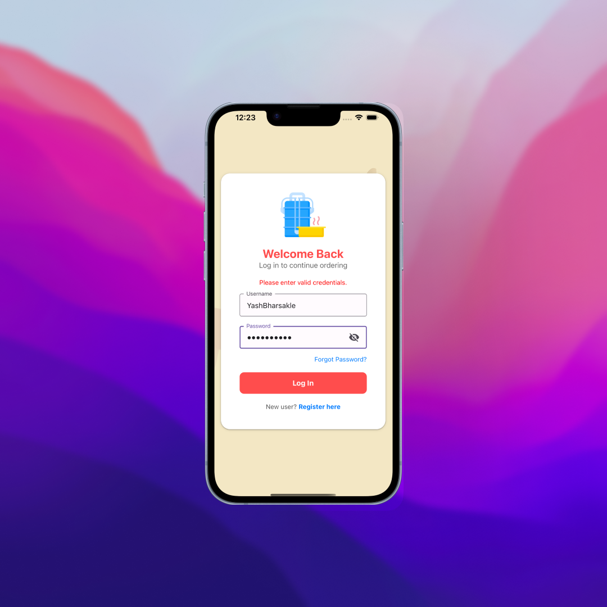
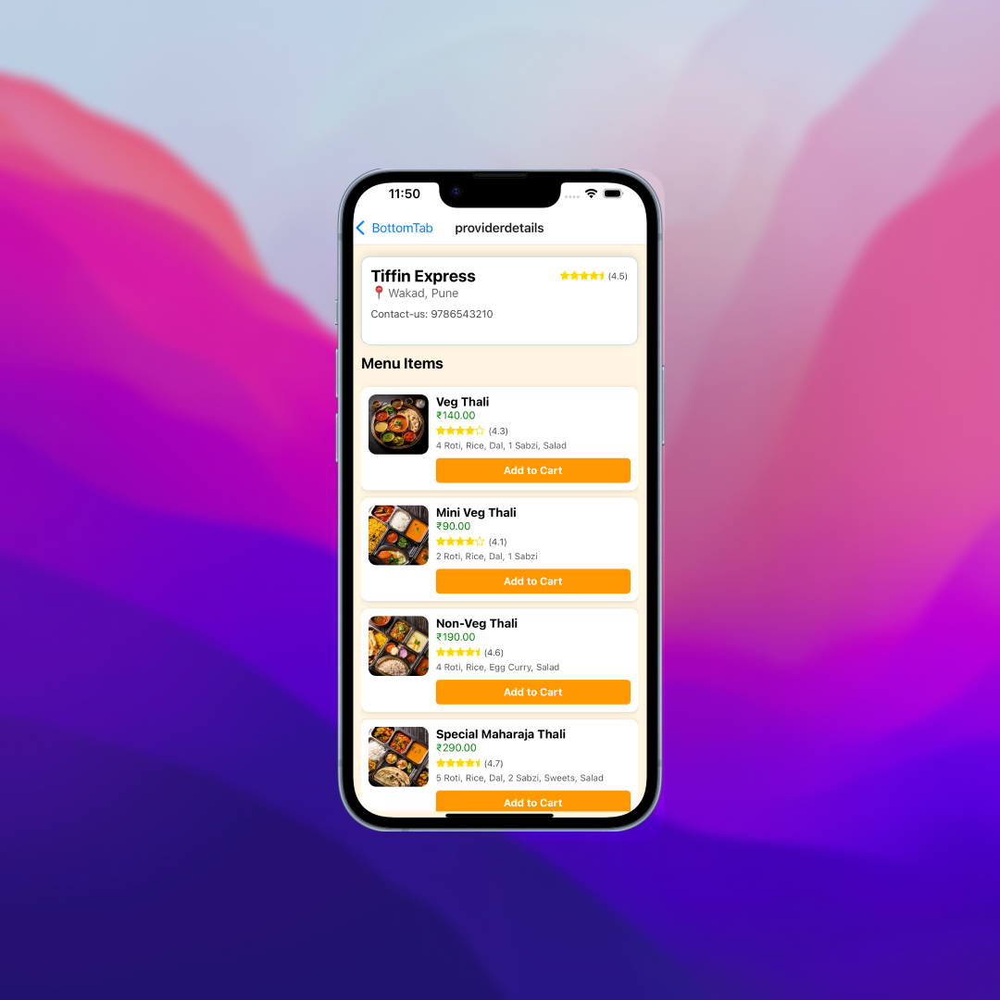
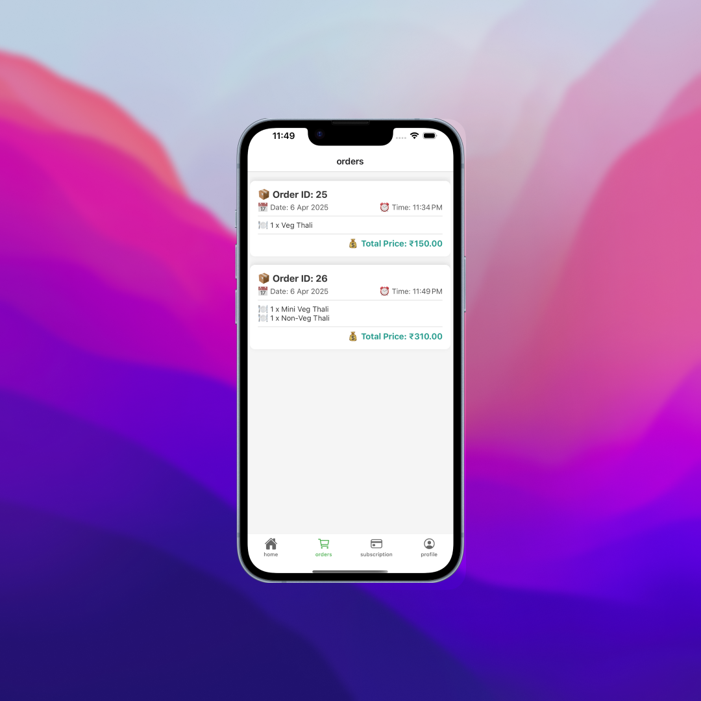

# 🍱 TDMS – Tiffin Delivery Management System

TDMS is a full-stack Tiffin Delivery Management System built using React, React Native, Node.js, Express, and MySQL. 
It allows customers to subscribe to daily/monthly/weekly tiffin services, view daily menus, make payments, register complaints, and more.

> 📱 Available for Android and iOS | 🌐 Admin dashboard on web
>
> ## 📸 Project Screenshots

### Login Screen


### Home Screen


### Menu View


### Order Placement


---

## 🚀 Features

### 👤 Customer
- View daily/weekly/monthly tiffin options
- Choose between mini/regular thalis, veg/non-veg
- Place and schedule orders
- View tiffin menu updates
- Track order status and delivery
- Register complaints and give feedback

### 🍳 Tiffin Provider
- Manage daily menu
- Handle subscriptions
- Track cooking requirements and upcoming orders

### 📦 Delivery Agent
- See assigned deliveries
- Mark deliveries as complete

### 🔐 Admin
- Manage users, providers, agents
- View and resolve complaints
- Handle feedback and reports

---

## 🛠️ Tech Stack

| Category         | Technologies                                |
|------------------|---------------------------------------------|
| Frontend         | React Native (Expo)                         |
| Backend API      | Node.js, Express                            |
| Database         | MySQL                                       |
| UI Components    | React Native Elements / Custom Styling      |
| Image Upload     | Cloudinary / Local (based on environment)   |
| Payment Gateway  | Razorpay / Stripe (optional)                |
| Version Control  | Git & GitHub                                |

---

## ⚙️ Setup Instructions

### 📦 Prerequisites

- Node.js ≥ 18
- npm or yarn
- MySQL Server
- Expo Go App (for testing on mobile)
- Git

### 🔧 Installation

1. Clone the Repository
   ```bash
   git clone https://github.com/yourusername/tdms.git
   cd tdms
   
2.	Install Dependencies

npm install
# or
yarn install


3.	Setup .env File
Create a .env file and add:

DB_HOST=localhost
DB_USER=root
DB_PASS=yourpassword
DB_NAME=tdms

4.	Run MySQL DB
	•	Import SQL schema from /backend/db/schema.sql

5.	Run Backend
cd backend
npm install
npm start

6.	Run Frontend
cd frontend
npx expo start


⸻

📸 Project Screenshots

Login	Home	Menu	Order
			

Add your own screenshots in /assets/screenshots/ and update the table above.

⸻

📂 Folder Structure

tdms/
├── backend/
│   ├── controllers/
│   ├── routes/
│   ├── models/
│   └── server.js
├── frontend/
│   ├── components/
│   ├── screens/
│   └── App.js
├── assets/
│   └── screenshots/
└── README.md


📧 Contact

Yash Vijay Bharsakle
📧 yashbharsakle451@gmail.com
🔗 LinkedIn
🌐 Portfolio

⸻

⭐️ Show your support

If you like this project, give it a ⭐ on GitHub and share it with others!
